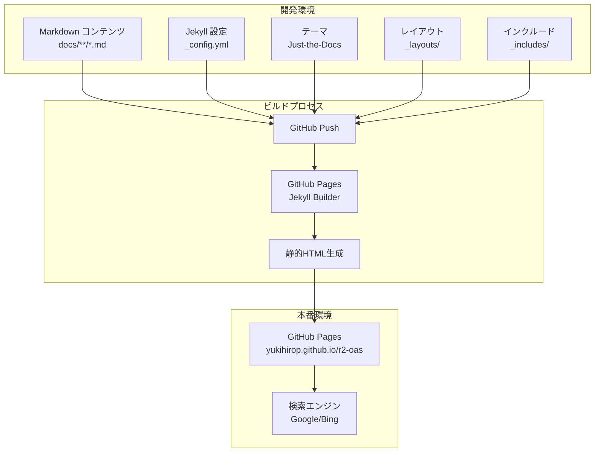
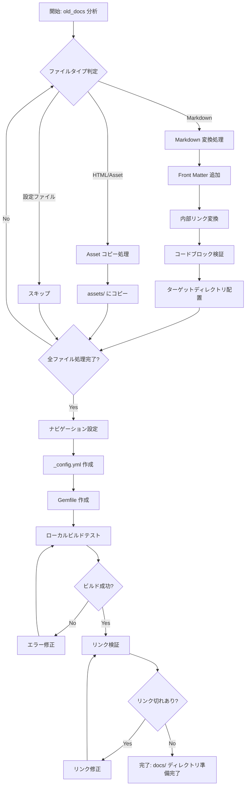
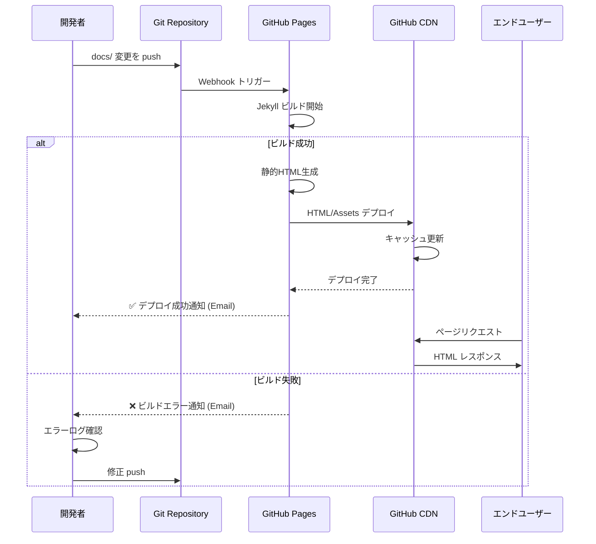
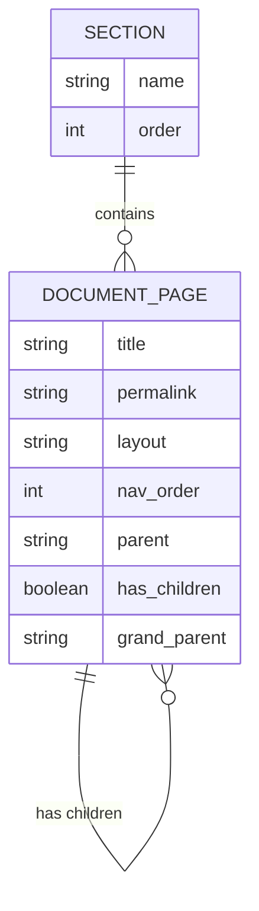
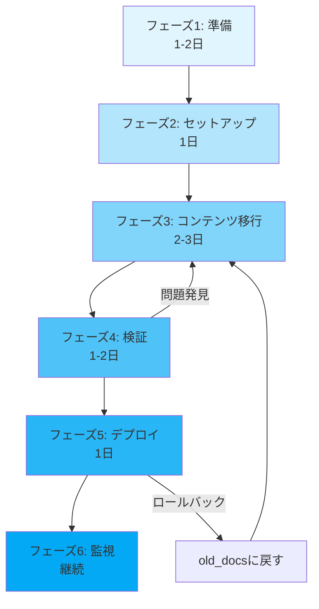

# 技術設計書: Jekyll ドキュメント移行

## 概要

R2-OAS プロジェクトのドキュメントサイトを Docsify から Jekyll + GitHub Pages に移行します。この移行により、静的サイト生成による高速化、GitHub Pages との完全統合、SEO 最適化、検索エンジンによる発見可能性の向上を実現します。

**目的**: 現在の `old_docs` (Docsify 形式) に保存されている全てのドキュメントコンテンツを、Jekyll ベースの `docs` ディレクトリに移行し、プロフェッショナルで保守性の高いドキュメントサイトを構築します。

**対象ユーザー**:
- R2-OAS gem のユーザー (使い方、設定方法を学ぶ開発者)
- コントリビューター (プロジェクトへの貢献を検討する開発者)
- プロジェクト管理者 (ドキュメントを保守・更新する管理者)

**影響**:
- 既存の `old_docs` ディレクトリは参照用として保持され、リネームまたはアーカイブされる
- 新しい `docs` ディレクトリが GitHub Pages のソースとなる
- ドキュメントサイトの URL 構造が変更される可能性があり、リダイレクト設定が必要

### ゴール

- Docsify から Jekyll への完全移行を実現する
- 全てのドキュメントコンテンツを構造を保って移行する
- GitHub Pages で自動ビルド・デプロイ可能な構成を確立する
- 検索機能とナビゲーションを提供し、ユーザビリティを向上させる
- SEO 最適化により、検索エンジンでの発見可能性を高める
- 将来的なドキュメント更新を容易にする仕組みを構築する

### 非ゴール

- ドキュメントコンテンツの大幅な書き直しや再構成 (コンテンツは基本的にそのまま移行)
- 多言語対応の実装 (将来の拡張として検討)
- 動的コンテンツやインタラクティブ機能の追加 (静的サイトの範囲内)
- CI/CD パイプラインでのカスタムビルドプロセス (GitHub Pages の標準ビルドを使用)

## アーキテクチャ

### 既存アーキテクチャ分析

**現在の構成 (Docsify)**:
```
old_docs/
├── index.html          # Docsify エントリーポイント
├── _sidebar.md         # サイドバーナビゲーション定義
├── .nojekyll          # Jekyll ビルド無効化
├── README.md          # トップページコンテンツ
├── usage/             # 使い方ガイド (16ファイル)
├── setting/           # 設定ガイド (COC, Configure, CORS)
├── schema/            # スキーマ仕様 (3.0.0)
├── attention/         # 注意事項
└── trableshouting/    # トラブルシューティング
```

**制約**:
- クライアントサイドレンダリング (JavaScriptに依存)
- SEO に不利 (SPA の制約)
- ビルドプロセスなし (動的読み込み)

### 高レベルアーキテクチャ



**アーキテクチャ統合**:
- **既存パターン保持**: プロジェクトのディレクトリ構造規約を維持 (`docs/` をドキュメントルートとする)
- **新規コンポーネント理由**:
  - Jekyll: 静的サイト生成によるパフォーマンス向上とSEO最適化
  - Just-the-Docs テーマ: ドキュメント専用設計、ナビゲーション・検索機能標準装備
  - GitHub Pages: 自動ビルド・デプロイによる運用負荷削減
- **技術アライメント**: Ruby エコシステムとの親和性 (R2-OAS は Ruby gem)
- **ステアリング準拠**: `structure.md` の原則に従い、明確なディレクトリ構造と命名規則を適用

### 技術スタックと設計判断

#### 静的サイト生成 (SSG)

**選択**: Jekyll 4.x
**理由**:
- GitHub Pages の公式サポート (自動ビルド、ゼロ設定)
- Ruby エコシステムとの親和性 (R2-OAS は Ruby gem)
- 成熟したプラグインエコシステムと豊富なドキュメント
- Liquid テンプレートエンジンによる柔軟なカスタマイズ

**代替案**:
- **Hugo**: より高速だが、Go ベースで GitHub Pages の自動ビルド非対応
- **Next.js/Docusaurus**: モダンだが、Node.js 依存で Ruby プロジェクトとの技術スタック乖離
- **MkDocs**: Python ベースで優れたドキュメント機能だが、技術スタック乖離

#### ドキュメントテーマ

**選択**: Just-the-Docs 0.10.x
**理由**:
- ドキュメント専用設計 (階層的ナビゲーション、検索、レスポンシブ対応)
- GitHub Pages ネイティブ対応 (追加設定不要)
- クライアントサイド検索 (Lunr.js) 標準装備
- アクセシビリティ重視の設計
- アクティブメンテナンス (2025年現在)

**代替案**:
- **Minima**: Jekyll デフォルトテーマだが、ブログ向きでドキュメント機能不足
- **Chirpy**: 美しいデザインだが、ドキュメント特化ではない
- **Doks**: 高速だが、Hugo ベース (GitHub Pages 自動ビルド非対応)

#### ホスティング

**選択**: GitHub Pages
**理由**:
- 無料ホスティング (オープンソースプロジェクト向け)
- 自動ビルド・デプロイ (master/main ブランチへの push で自動更新)
- カスタムドメイン対応
- HTTPS 標準対応
- Jekyll ビルド環境標準装備

**代替案**:
- **Netlify/Vercel**: 高機能だが、無料枠制限とプロジェクト規模に対してオーバースペック
- **Read the Docs**: Python プロジェクト向けで技術スタック不一致

### 主要な設計判断

#### 判断1: コンテンツマイグレーション戦略

**判断**: 手動マイグレーションスクリプトではなく、体系的な一括移行プロセスを採用する

**コンテキスト**:
- `old_docs` には約20個のMarkdownファイルが存在
- ファイル構造とコンテンツを維持しながら、Jekyll Front Matter を追加する必要がある
- 内部リンクを Docsify 形式から Jekyll 形式に変換する必要がある

**代替案**:
1. **手動コピー**: 各ファイルを手動でコピーして Front Matter を追加
2. **自動スクリプト**: Ruby/Python スクリプトで一括変換
3. **段階的移行**: セクションごとに段階的に移行

**選択アプローチ**: 半自動化された一括移行 (スクリプト支援 + 手動検証)

**理由**:
- **効率性**: 20ファイル程度なら手動でも可能だが、Front Matter の一貫性とリンク変換の正確性を担保するためスクリプト支援が有効
- **品質保証**: 自動変換後に手動検証を実施し、コンテンツの完全性を確認
- **再現性**: 将来的な追加移行や修正に備えて、変換プロセスを文書化

**トレードオフ**:
- **利点**: 一貫性、正確性、再現性の確保
- **犠牲**: スクリプト開発の初期コスト (ただし20ファイル規模では小さい)

#### 判断2: ナビゲーション構造の管理方法

**判断**: Just-the-Docs の Front Matter ベースナビゲーションを採用 (`nav_order`, `parent`, `has_children`)

**コンテキスト**:
- Docsify は `_sidebar.md` で集中管理
- Jekyll では複数のナビゲーション管理方法が存在
- 階層的なドキュメント構造 (Usage, Configuration, Schema, Troubleshooting) を表現する必要がある

**代替案**:
1. **`_data/navigation.yml`**: 集中管理型 (Docsify _sidebar.md と類似)
2. **Front Matter (`nav_order`, `parent`)**: 分散管理型
3. **ディレクトリ構造依存**: 自動生成

**選択アプローチ**: Front Matter ベースナビゲーション

**理由**:
- **Just-the-Docs 標準**: テーマの推奨方式でドキュメントとサポートが充実
- **柔軟性**: 各ドキュメントファイルが独立して順序とグループを定義可能
- **スケーラビリティ**: ドキュメント追加時に他のファイルを変更不要
- **メンテナンス**: ナビゲーション情報とコンテンツが同じファイルに保存され、整合性維持が容易

**トレードオフ**:
- **利点**: 分散管理による柔軟性、メンテナンス性向上
- **犠牲**: ナビゲーション全体像の把握が `_sidebar.md` より困難 (ドキュメントで補完)

#### 判断3: 検索機能の実装方法

**判断**: Just-the-Docs 内蔵の Lunr.js ベースクライアントサイド検索を使用

**コンテキスト**:
- Docsify は JavaScript ベースの検索を提供
- Jekyll では複数の検索ソリューションが存在
- GitHub Pages のビルド制約 (カスタムプラグイン制限)

**代替案**:
1. **Lunr.js (Just-the-Docs 内蔵)**: クライアントサイド、設定不要
2. **Algolia (Jekyll-Algolia)**: サーバーサイド、高速、無料枠あり
3. **Google Custom Search**: 外部サービス、広告表示

**選択アプローチ**: Just-the-Docs 内蔵 Lunr.js

**理由**:
- **ゼロ設定**: Just-the-Docs テーマに標準装備、追加設定不要
- **プライバシー**: サードパーティサービス不要、ユーザーデータ外部送信なし
- **コスト**: 完全無料、外部サービスのクォータ管理不要
- **パフォーマンス**: ドキュメント規模 (20-30ページ) では十分な速度

**トレードオフ**:
- **利点**: シンプルさ、プライバシー保護、ゼロコスト
- **犠牲**: 大規模ドキュメント (100+ ページ) では速度低下の可能性、検索精度は Algolia に劣る

## システムフロー

### ドキュメント移行フロー



### GitHub Pages デプロイフロー



## 要件トレーサビリティ

| 要件 | 要件概要 | コンポーネント | インターフェース | フロー |
|------|---------|--------------|--------------|--------|
| 1.1-1.4 | Jekyll プロジェクト構造 | Jekyll ディレクトリ構造, _config.yml, Gemfile | ファイルシステム | ドキュメント移行フロー |
| 2.1-2.4 | コンテンツ移行とマッピング | Markdown 変換, Front Matter, リンク変換 | Markdown → Jekyll Markdown | ドキュメント移行フロー |
| 3.1-3.4 | ナビゲーション構造 | Just-the-Docs ナビゲーション, _data/navigation.yml | Front Matter (`nav_order`, `parent`) | - |
| 4.1-4.4 | レイアウトとテーマ | Just-the-Docs テーマ, カスタム _layouts/, _includes/ | Liquid テンプレート | - |
| 5.1-5.4 | 検索機能 | Lunr.js (Just-the-Docs 内蔵) | JavaScript API | - |
| 6.1-6.5 | Markdown 拡張 | Kramdown パーサー, カスタム includes | Markdown + Liquid | - |
| 7.1-7.5 | GitHub Pages デプロイ | GitHub Pages ビルドシステム | GitHub Webhook | GitHub Pages デプロイフロー |
| 8.1-8.5 | コンテンツ整合性検証 | HTML Proofer (オプション) | CLI ツール | ドキュメント移行フロー |
| 9.1-9.4 | SEO 最適化 | jekyll-seo-tag, jekyll-sitemap | Front Matter メタデータ | - |
| 10.1-10.5 | 保守性 | ドキュメント, テンプレート, ローカルビルド環境 | `bundle exec jekyll serve` | - |

## コンポーネントとインターフェース

### Jekyll プロジェクト構造

#### Jekyll コア設定

**責任と境界**:
- **主責任**: Jekyll サイト全体の設定とビルド動作の制御
- **ドメイン境界**: ドキュメントサイトのビルド・レンダリング層
- **データ所有**: サイトメタデータ、テーマ設定、プラグイン設定

**依存関係**:
- **インバウンド**: GitHub Pages ビルドシステム、ローカル開発環境
- **アウトバウンド**: Just-the-Docs テーマ、Jekyll プラグイン (jekyll-seo-tag, jekyll-sitemap)
- **外部**: Ruby gem エコシステム

**契約定義** (設定ファイル):

```yaml
# docs/_config.yml
title: "R2-OAS Documentation"
description: "OpenAPI documentation generator for Rails"
baseurl: "/r2-oas"
url: "https://yukihirop.github.io"

# テーマ設定
theme: just-the-docs
color_scheme: light

# プラグイン設定
plugins:
  - jekyll-seo-tag
  - jekyll-sitemap

# Markdown設定
markdown: kramdown
kramdown:
  input: GFM
  syntax_highlighter: rouge
  syntax_highlighter_opts:
    block:
      line_numbers: true

# 検索設定
search_enabled: true
search:
  heading_level: 2
  previews: 3
  preview_words_before: 5
  preview_words_after: 10

# ナビゲーション設定
nav_sort: case_insensitive

# 外部リンク
aux_links:
  "GitHub Repository":
    - "https://github.com/yukihirop/r2-oas"
```

**事前条件**:
- Ruby 2.7+ がインストールされている
- Bundler gem がインストールされている
- `Gemfile` が存在し、依存関係が定義されている

**事後条件**:
- `bundle exec jekyll build` で静的HTMLが `_site/` に生成される
- `bundle exec jekyll serve` でローカルサーバーが起動する

**不変条件**:
- `baseurl` と `url` の組み合わせで正しいURLが生成される
- すべてのMarkdownファイルが有効な Front Matter を持つ

### ドキュメントコンテンツ

#### Markdown ドキュメント

**責任と境界**:
- **主責任**: ユーザー向けドキュメントコンテンツの提供
- **ドメイン境界**: コンテンツ層 (表示ロジックは含まない)
- **データ所有**: ドキュメントテキスト、コードサンプル、図表

**依存関係**:
- **インバウンド**: Jekyll ビルドプロセス、Just-the-Docs テーマ
- **アウトバウンド**: なし (純粋なコンテンツ)
- **外部**: なし

**契約定義** (Front Matter フォーマット):

```markdown
---
layout: default
title: "Generate Docs"
nav_order: 3
parent: "Usage"
permalink: /usage/generate-docs/
---

# Generate Docs

ドキュメント生成の使い方を説明します。

## 基本的な使い方

\`\`\`bash
bundle exec rake routes:oas:docs
\`\`\`

## 詳細オプション

...
```

**Front Matter 必須フィールド**:
- `layout`: 使用するレイアウト (`default` または `page`)
- `title`: ページタイトル
- `permalink`: カスタムURL (オプション、推奨)

**Front Matter オプションフィールド**:
- `nav_order`: ナビゲーション順序 (数値)
- `parent`: 親ページタイトル (階層構造用)
- `has_children`: 子ページの有無 (boolean)
- `grand_parent`: 祖父母ページタイトル (3階層構造用)

**ディレクトリマッピング**:
```
old_docs/usage/*.md        → docs/usage/
old_docs/setting/*.md      → docs/configuration/
old_docs/schema/*.md       → docs/schema/
old_docs/attention/*.md    → docs/guides/
old_docs/trableshouting/*  → docs/troubleshooting/
old_docs/README.md         → docs/index.md
```

### レイアウトとテーマ

#### Just-the-Docs テーマ

**責任と境界**:
- **主責任**: ドキュメントサイトの外観と構造の提供
- **ドメイン境界**: プレゼンテーション層
- **データ所有**: レイアウトテンプレート、CSS、JavaScript

**依存関係**:
- **インバウンド**: Jekyll ビルドプロセス、Markdown コンテンツ
- **アウトバウンド**: Lunr.js (検索)、Rouge (シンタックスハイライト)
- **外部**: GitHub Pages 環境

**外部依存調査** (Just-the-Docs):
- **公式ドキュメント**: https://just-the-docs.com/
- **GitHub リポジトリ**: https://github.com/just-the-docs/just-the-docs
- **バージョン**: 0.10.x (2025年現在、アクティブメンテナンス)
- **互換性**: Jekyll 3.8.5+, GitHub Pages ネイティブ対応
- **主要機能**:
  - 階層的ナビゲーション (3階層まで対応)
  - クライアントサイド検索 (Lunr.js)
  - レスポンシブデザイン (モバイル対応)
  - カラースキーム切り替え (light/dark)
  - コードブロックのコピーボタン
- **設定方法**: `_config.yml` の `theme: just-the-docs` のみで有効化
- **カスタマイズ**: `_sass/custom/custom.scss` で CSS オーバーライド可能

**契約定義** (レイアウト):

Just-the-Docs は以下の標準レイアウトを提供:
- `default`: すべてのページのベースレイアウト (ナビゲーション、フッター含む)
- `home`: トップページ専用レイアウト
- `page`: 標準ページレイアウト (default のエイリアス)
- `minimal`: 最小限のレイアウト (ナビゲーションなし)

**カスタムレイアウト** (必要に応じて `_layouts/` に追加):
```html
---
layout: default
---

<div class="custom-container">
  {{ content }}
</div>
```

**カスタム Includes** (`_includes/` に配置):
```liquid
<!-- _includes/custom/info_box.html -->
<div class="info-box">
  <div class="info-box-icon">ℹ️</div>
  <div class="info-box-content">
    {{ include.content }}
  </div>
</div>
```

使用例:
```markdown

```

### 検索機能

#### Lunr.js クライアントサイド検索

**責任と境界**:
- **主責任**: ドキュメントのフルテキスト検索機能の提供
- **ドメイン境界**: クライアントサイド検索エンジン
- **データ所有**: 検索インデックス (JSON)

**依存関係**:
- **インバウンド**: Just-the-Docs テーマ、ユーザー入力
- **アウトバウンド**: なし (スタンドアロン JavaScript ライブラリ)
- **外部**: Lunr.js CDN (Just-the-Docs バンドル版)

**外部依存調査** (Lunr.js):
- **公式サイト**: https://lunrjs.com/
- **バージョン**: 2.3.x (Just-the-Docs にバンドル)
- **機能**:
  - フルテキスト検索
  - ステミング (英語、日本語サポート)
  - ブール演算子 (AND, OR, NOT)
  - フィールド別検索
- **パフォーマンス**: 1000ドキュメントまで快適、それ以上は遅延の可能性
- **ビルド時動作**: Jekyll ビルド時に検索インデックス JSON 生成
- **ブラウザ要件**: ES5+ (IE11+)

**契約定義** (検索インデックス生成):

Just-the-Docs は自動的に検索インデックスを生成:
```json
// _site/assets/js/search-data.json (自動生成)
{
  "docs": [
    {
      "title": "Generate Docs",
      "url": "/r2-oas/usage/generate-docs/",
      "content": "ドキュメント生成の使い方...",
      "relUrl": "/usage/generate-docs/"
    }
  ]
}
```

**検索動作**:
1. ユーザーが検索ボックスに入力
2. JavaScript が `search-data.json` を読み込み (初回のみ)
3. Lunr.js がクエリを実行
4. 結果をリアルタイムで表示 (スニペット、リンク)

**カスタマイズ** (`_config.yml`):
```yaml
search_enabled: true
search:
  heading_level: 2        # H2までのみインデックス化
  previews: 3             # プレビュー数
  preview_words_before: 5 # マッチ前の単語数
  preview_words_after: 10 # マッチ後の単語数
```

### デプロイとビルド

#### GitHub Pages ビルドシステム

**責任と境界**:
- **主責任**: Jekyll サイトの自動ビルドと公開
- **ドメイン境界**: CI/CD 層
- **データ所有**: ビルド成果物 (静的HTML)

**依存関係**:
- **インバウンド**: Git リポジトリ (master/main ブランチ)
- **アウトバウンド**: GitHub CDN
- **外部**: GitHub インフラストラクチャ

**外部依存調査** (GitHub Pages):
- **公式ドキュメント**: https://docs.github.com/pages
- **サポートされる Jekyll バージョン**: 3.9.x (2025年現在)
- **サポートされるプラグイン** (ホワイトリスト):
  - jekyll-seo-tag
  - jekyll-sitemap
  - jekyll-feed
  - jekyll-paginate
  - jemoji
  - 他数種類
- **制約**:
  - カスタムプラグイン (ホワイトリスト外) は使用不可
  - ビルド時間: 最大10分
  - リポジトリサイズ: 1GB まで推奨
  - 月間帯域幅: 100GB (ソフトリミット)
- **ビルドトリガー**: master/main ブランチへの push、または `/docs` ディレクトリの変更
- **ビルド通知**: Email で成功/失敗を通知
- **デプロイ URL**: `https://<username>.github.io/<repository>/`

**契約定義** (デプロイ設定):

**リポジトリ設定** (GitHub Web UI):
```
Settings > Pages > Source:
  - Branch: master
  - Folder: /docs
```

**Gemfile** (`docs/Gemfile`):
```ruby
source "https://rubygems.org"

gem "jekyll", "~> 3.9"
gem "just-the-docs", "~> 0.10"

group :jekyll_plugins do
  gem "jekyll-seo-tag"
  gem "jekyll-sitemap"
end
```

**`.gitignore` 追加**:
```
docs/_site/
docs/.jekyll-cache/
docs/.sass-cache/
```

**デプロイフロー**:
1. 開発者が `docs/` 配下のファイルを編集
2. `git commit && git push origin master` で変更を push
3. GitHub Pages が Webhook を受信
4. Jekyll ビルドを開始 (約1-3分)
5. 成功時: 静的HTMLを GitHub CDN にデプロイ
6. 失敗時: Email でエラーログを送信

**ロールバック戦略**:
- Git revert でコミットを取り消し、再 push
- 以前のコミットに戻して force push (非推奨)

## データモデル

### ドキュメントメタデータ (Front Matter)

**ドメインモデル**:
- **エンティティ**: ドキュメントページ (一意な permalink を持つ)
- **値オブジェクト**: Front Matter メタデータ (不変)
- **集約**: ドキュメントセクション (親子関係を持つページグループ)

**ビジネスルールと不変条件**:
- 各ドキュメントページは一意な `permalink` を持つ
- 親子関係 (`parent`, `has_children`) は整合性を保つ
- `nav_order` は同じ階層内で一意であるべき (推奨)

**論理データモデル**:



**エンティティ関係**:
- **SECTION** (1) → (多) **DOCUMENT_PAGE**: 1つのセクションは複数のページを含む
- **DOCUMENT_PAGE** (1) → (多) **DOCUMENT_PAGE**: 親ページは複数の子ページを持つ

**物理データモデル** (ファイルシステム):

```
docs/
├── index.md                    # トップページ (permalink: /)
├── usage/                      # Usageセクション
│   ├── index.md               # セクションインデックス (parent: null, has_children: true)
│   ├── initialize.md          # (parent: "Usage", nav_order: 1)
│   ├── generate-docs.md       # (parent: "Usage", nav_order: 2)
│   └── ...
├── configuration/              # Configurationセクション
│   ├── index.md
│   ├── coc.md
│   └── configure.md
└── ...
```

**Front Matter スキーマ** (TypeScript 表記):

```typescript
interface FrontMatter {
  layout: "default" | "home" | "page" | "minimal";
  title: string;
  permalink?: string;  // 推奨: SEO フレンドリーな URL
  nav_order?: number;  // 同階層での表示順序
  parent?: string;     // 親ページのタイトル
  has_children?: boolean;
  grand_parent?: string;
  description?: string; // SEO用説明文
  keywords?: string[];  // SEO用キーワード
}
```

**サンプル Front Matter**:

```yaml
---
layout: default
title: "Generate Docs"
permalink: /usage/generate-docs/
nav_order: 2
parent: "Usage"
description: "R2-OAS でOpenAPIドキュメントを生成する方法"
keywords: ["r2-oas", "openapi", "documentation", "rails"]
---
```

## エラーハンドリング

### エラー戦略

Jekyll ビルドプロセスにおけるエラーは、主にビルド時に検出されます。GitHub Pages でのビルドエラーは Email で通知され、ローカルビルドでは標準出力にエラーメッセージが表示されます。

**基本原則**:
- **早期検出**: ローカルビルド (`bundle exec jekyll build`) で事前検証
- **明確なメッセージ**: Jekyll のエラーメッセージは詳細 (ファイルパス、行番号含む)
- **リカバリ**: Git revert でロールバック可能

### エラーカテゴリと対応

#### ビルドエラー (システムエラー)

**Liquid 構文エラー**:
```
Liquid Exception: Liquid syntax error (line 42): Unknown tag 'endnote' in docs/usage/generate-docs.md
```
- **原因**: 未定義の Liquid タグまたは閉じタグ不一致
- **対応**: Markdown ファイルの Liquid 構文を修正
- **リカバリ**: `bundle exec jekyll build` でローカル検証、修正後再ビルド

**Front Matter パースエラー**:
```
Error: YAML Exception reading docs/usage/initialize.md: (<unknown>): mapping values are not allowed in this context at line 4 column 11
```
- **原因**: Front Matter の YAML 構文エラー (インデント、引用符不足など)
- **対応**: YAML バリデータで検証、構文修正
- **リカバリ**: オンライン YAML パーサー (https://yaml-online-parser.appspot.com/) で検証

**依存関係エラー**:
```
Dependency Error: Yikes! It looks like you don't have just-the-docs or one of its dependencies installed.
```
- **原因**: Gemfile の依存関係未インストールまたはバージョン不一致
- **対応**: `bundle install` で依存関係を再インストール
- **リカバリ**: `bundle update` で最新版に更新

#### コンテンツエラー (ユーザーエラー)

**リンク切れ**:
```
404 Not Found: /usage/non-existent-page/
```
- **原因**: 存在しないページへの内部リンク、または permalink 不一致
- **対応**: HTML Proofer でリンク検証、リンク修正
- **検証コマンド**:
  ```bash
  bundle exec htmlproofer _site --assume-extension --check-html --only-4xx
  ```
- **リカバリ**: リンク先のファイルパスまたは permalink を修正

**画像・アセット 404**:
```
Asset not found: /assets/images/diagram.png
```
- **原因**: 画像ファイルが存在しない、またはパス不一致
- **対応**: アセットファイルを `docs/assets/` に配置、パス修正
- **リカバリ**: 相対パスを `{{ site.baseurl }}/assets/images/diagram.png` に修正

#### GitHub Pages 固有エラー

**プラグイン未サポート**:
```
GitHub Pages: The plugin 'jekyll-custom-plugin' is not supported by GitHub Pages.
```
- **原因**: ホワイトリスト外のプラグインを使用
- **対応**: サポートされるプラグインに置き換え、またはカスタムビルドプロセスに移行
- **代替案**: GitHub Actions で Jekyll ビルドを実行し、成果物を `gh-pages` ブランチにデプロイ

**ビルドタイムアウト**:
```
Build exceeded maximum execution time of 10 minutes
```
- **原因**: ドキュメント数が多すぎる、またはプラグインが重い
- **対応**: ドキュメントを分割、または incremental build を有効化
- **設定**: `_config.yml` に `incremental: true` 追加 (注意: GitHub Pages では未サポート)

### モニタリング

**ローカル開発**:
- `bundle exec jekyll serve --livereload` でリアルタイムプレビュー
- ブラウザコンソールで JavaScript エラーを確認
- ビルドログで警告とエラーを確認

**本番環境** (GitHub Pages):
- Email 通知でビルド成功/失敗を確認
- GitHub Actions タブでビルドログを確認
- Google Search Console でインデックスエラーを確認

**ログレベル**:
```bash
# 詳細ログ
bundle exec jekyll build --verbose

# トレースログ
bundle exec jekyll build --trace
```

## テスト戦略

### ユニットテスト

**対象**: カスタム Liquid フィルター、プラグイン (該当する場合)

**テスト項目**:
1. **Liquid フィルターのテスト** (カスタムフィルター作成時):
   - 入力値の変換ロジックが正しいこと
   - エッジケース (空文字列、nil、特殊文字) のハンドリング
2. **Front Matter パースのテスト**:
   - 有効な Front Matter が正しく読み込まれること
   - 無効な Front Matter でエラーが発生すること
3. **URL 生成のテスト**:
   - `permalink` が正しく生成されること
   - `baseurl` が正しく付与されること

**テスト方法**:
- RSpec でカスタムプラグインをテスト (該当する場合)
- 手動検証: ローカルビルドで生成された HTML を確認

### インテグレーションテスト

**対象**: Jekyll ビルドプロセス全体、ナビゲーション、検索機能

**テスト項目**:
1. **ビルド成功テスト**:
   - `bundle exec jekyll build` がエラーなく完了すること
   - すべての Markdown ファイルが HTML に変換されること
2. **ナビゲーション生成テスト**:
   - サイドバーナビゲーションが正しく表示されること
   - 親子関係が正しく反映されること
   - `nav_order` 順に並んでいること
3. **検索機能テスト**:
   - 検索インデックス JSON が生成されること
   - 検索クエリで関連ページが返されること
   - 日本語検索が機能すること
4. **リンク検証テスト**:
   - 内部リンクが全て有効であること
   - 外部リンクが 404 エラーを返さないこと
5. **アセット読み込みテスト**:
   - CSS、JavaScript、画像が正しく読み込まれること

**テスト方法**:
```bash
# ビルドテスト
bundle exec jekyll build

# リンク検証 (HTML Proofer)
bundle exec htmlproofer _site \
  --assume-extension \
  --check-html \
  --only-4xx \
  --allow-hash-href \
  --disable-external

# 手動テスト: ローカルサーバー起動
bundle exec jekyll serve
# ブラウザで http://localhost:4000/r2-oas/ にアクセス
```

### E2E テスト (UI テスト)

**対象**: ユーザーが実際にサイトを使用するシナリオ

**テスト項目**:
1. **トップページ表示**:
   - トップページが正しく表示されること
   - ヘッダー、ナビゲーション、フッターが表示されること
2. **ドキュメントページ閲覧**:
   - サイドバーからページに移動できること
   - コードブロックが正しくハイライトされること
   - 画像が表示されること
3. **検索機能**:
   - 検索ボックスにクエリを入力できること
   - 検索結果が表示されること
   - 検索結果からページに移動できること
4. **レスポンシブ対応**:
   - モバイルデバイスでナビゲーションが表示されること
   - ハンバーガーメニューが機能すること

**テスト方法**:
- 手動テスト: 実際にブラウザで操作して確認
- Playwright/Cypress でE2Eテスト自動化 (オプション、将来的な拡張)

**手動テストチェックリスト**:
```
[ ] トップページ表示 (デスクトップ)
[ ] トップページ表示 (モバイル)
[ ] ナビゲーション展開/折りたたみ
[ ] ドキュメントページ閲覧 (各セクション)
[ ] 検索機能 (キーワード: "generate", "configure")
[ ] コードブロックのコピーボタン
[ ] 外部リンク (GitHub) が新しいタブで開く
[ ] ダークモード切り替え (Just-the-Docs機能)
```

### パフォーマンステスト (オプション)

**対象**: ページ読み込み速度、検索速度

**テスト項目**:
1. **ページ読み込み速度**:
   - 初回読み込み: 2秒以内
   - キャッシュ後: 1秒以内
2. **検索速度**:
   - 検索インデックス読み込み: 500ms 以内
   - 検索クエリ実行: 100ms 以内
3. **Lighthouse スコア**:
   - Performance: 90+
   - Accessibility: 95+
   - Best Practices: 90+
   - SEO: 100

**テスト方法**:
```bash
# Lighthouse CLI
npm install -g lighthouse
lighthouse https://yukihirop.github.io/r2-oas/ --output html --output-path ./lighthouse-report.html

# または Chrome DevTools の Lighthouse タブを使用
```

## セキュリティ考慮事項

### 脅威モデリング

**脅威シナリオ**:
1. **XSS (Cross-Site Scripting)**:
   - Markdown コンテンツに悪意のあるスクリプトが埋め込まれる
   - Liquid テンプレートで変数が適切にエスケープされない
2. **情報漏洩**:
   - 機密情報 (API キー、パスワード) がドキュメントに誤って含まれる
   - Git 履歴に機密情報が残る
3. **依存関係の脆弱性**:
   - Jekyll または依存 gem に既知の脆弱性が存在
   - サプライチェーン攻撃 (悪意のある gem)

### セキュリティ対策

#### XSS 対策

**Markdown エスケープ**:
- Jekyll の Kramdown パーサーは自動的に HTML タグをエスケープ
- `kramdown` 設定で `parse_block_html: false` を維持 (HTML ブロック無効化)

**Liquid エスケープ**:
```liquid
{{ user_input | escape }}
{{ user_input | strip_html }}
```

**Content Security Policy (CSP)**:
- GitHub Pages では CSP ヘッダーをカスタマイズ不可
- Just-the-Docs テーマはインライン JavaScript を最小化

#### 機密情報保護

**`.gitignore` 設定**:
```
# 環境変数
.env
.env.local

# ビルド成果物
_site/
.jekyll-cache/

# 機密ファイル
**/secrets.yml
**/credentials.*
```

**Git 履歴スキャン**:
```bash
# Gitleaks でシークレットスキャン
docker run -v $(pwd):/path zricethezav/gitleaks:latest detect --source="/path" --verbose
```

**レビュープロセス**:
- Pull Request で機密情報が含まれていないか確認
- `.md` ファイルに API キー、パスワードが含まれていないかチェック

#### 依存関係の脆弱性管理

**Bundler Audit**:
```bash
# bundle-audit gem をインストール
gem install bundler-audit

# 脆弱性スキャン
bundle audit check --update

# Gemfile.lock の更新
bundle update --conservative
```

**GitHub Dependabot**:
- Dependabot Alerts を有効化 (Settings > Security > Dependabot alerts)
- 自動 Pull Request で脆弱性修正

**定期更新**:
- 四半期ごとに `bundle update` で依存関係を更新
- Jekyll と Just-the-Docs のリリースノートを確認

### コンプライアンス

**GDPR (一般データ保護規則)**:
- ドキュメントサイトは個人データを収集しない
- Google Analytics などの追跡ツールを使用する場合、Cookie 同意バナーを実装

**アクセシビリティ (WCAG 2.1)**:
- Just-the-Docs はアクセシビリティ準拠を目指している
- スクリーンリーダー対応
- キーボードナビゲーション対応
- 適切な色コントラスト比

## パフォーマンスとスケーラビリティ

### ターゲットメトリクス

**ページ読み込み速度**:
- 初回読み込み (Cold Cache): 2秒以内
- 再読み込み (Warm Cache): 1秒以内
- Time to First Byte (TTFB): 500ms 以内

**ビルド時間**:
- ローカルビルド: 30秒以内 (ドキュメント20-30ページ想定)
- GitHub Pages ビルド: 3分以内

**検索パフォーマンス**:
- 検索インデックス読み込み: 500ms 以内
- 検索クエリ実行: 100ms 以内

### スケーリングアプローチ

**水平スケーリング** (コンテンツ増加):
- ドキュメント数が100ページを超える場合、カテゴリごとにサイトを分割
- マルチリポジトリ戦略: `r2-oas-docs-core`, `r2-oas-docs-api` など

**垂直スケーリング** (機能拡張):
- 検索機能を Algolia に移行 (クライアントサイド → サーバーサイド)
- 画像最適化: responsive images, lazy loading

### キャッシング戦略

**ブラウザキャッシュ**:
- GitHub Pages は自動的に適切な Cache-Control ヘッダーを設定
- 静的アセット (CSS, JS, 画像) は長期キャッシュ (1年)
- HTML は短期キャッシュ (5分)

**CDN キャッシュ**:
- GitHub Pages は Fastly CDN を使用
- グローバルエッジキャッシング (世界中のユーザーに高速配信)

**検索インデックスキャッシュ**:
- `search-data.json` は初回読み込み時にブラウザキャッシュに保存
- ページ遷移時に再利用 (追加リクエスト不要)

### 最適化手法

**画像最適化**:
```bash
# ImageOptim CLI で画像圧縮
imageoptim docs/assets/images/**/*.png

# WebP 変換
cwebp docs/assets/images/screenshot.png -o docs/assets/images/screenshot.webp
```

**Markdown 内での responsive images**:
```html
<picture>
  <source srcset="{{ site.baseurl }}/assets/images/diagram.webp" type="image/webp">
  
</picture>
```

**コードブロック最適化**:
- 長いコードブロックは折りたたみ可能にする (Just-the-Docs の機能)
- シンタックスハイライトは Rouge (高速、軽量)

**Lazy Loading**:
```markdown
{: loading="lazy" }
```

## 移行戦略



### フェーズ1: 準備 (1-2日)

**タスク**:
1. 現在の `old_docs` の完全バックアップ
2. Jekyll と Just-the-Docs の調査とローカル環境構築
3. ディレクトリマッピングとコンテンツ棚卸し
4. Front Matter テンプレートの設計
5. リンク変換ルールの定義

**成果物**:
- バックアップアーカイブ (`old_docs.tar.gz`)
- 移行計画書 (このドキュメント)
- Front Matter テンプレート
- リンク変換スクリプト (Ruby/Python)

**検証基準**:
- ローカルで Jekyll サイトが起動すること
- Just-the-Docs テーマが適用されること

### フェーズ2: セットアップ (1日)

**タスク**:
1. `docs/` ディレクトリ作成と初期構造セットアップ
2. `_config.yml` の作成と設定
3. `Gemfile` の作成と依存関係インストール
4. カスタムレイアウト・includes の作成
5. `.gitignore` の設定

**成果物**:
- `docs/_config.yml`
- `docs/Gemfile`
- `docs/_layouts/` (必要に応じて)
- `docs/_includes/custom/` (情報ボックスなど)

**検証基準**:
- `bundle exec jekyll serve` でサイトが起動すること
- トップページが表示されること

### フェーズ3: コンテンツ移行 (2-3日)

**タスク**:
1. Markdown ファイルの一括コピーとディレクトリ再配置
2. Front Matter の自動追加 (スクリプト実行)
3. 内部リンクの変換 (Docsify → Jekyll)
4. コードブロックと画像パスの検証
5. ナビゲーション順序 (`nav_order`) の調整
6. SEO メタデータ (`description`, `keywords`) の追加

**スクリプト例** (Ruby):
```ruby
# migrate_docs.rb
require 'yaml'
require 'fileutils'

SOURCE_DIR = 'old_docs'
TARGET_DIR = 'docs'

DIRECTORY_MAPPING = {
  'usage' => 'usage',
  'setting' => 'configuration',
  'schema' => 'schema',
  'attention' => 'guides',
  'trableshouting' => 'troubleshooting'
}

def add_front_matter(content, title, permalink, parent: nil, nav_order: nil)
  front_matter = {
    'layout' => 'default',
    'title' => title,
    'permalink' => permalink
  }
  front_matter['parent'] = parent if parent
  front_matter['nav_order'] = nav_order if nav_order

  "---\n#{front_matter.to_yaml}---\n\n#{content}"
end

def convert_links(content)
  # Docsify リンク → Jekyll リンク
  content.gsub(/\[([^\]]+)\]\(\/([^)]+)\)/, '[\\1]({{ site.baseurl }}/\\2/)')
end

# 実装続く...
```

**成果物**:
- 移行済み Markdown ファイル (`docs/**/*.md`)
- 変換ログ (成功/失敗ファイルのリスト)

**検証基準**:
- 全ての `.md` ファイルが移行されていること
- `bundle exec jekyll build` がエラーなく完了すること

### フェーズ4: 検証 (1-2日)

**タスク**:
1. ローカルビルドとプレビュー
2. 全ページの手動確認 (コンテンツ、レイアウト、ナビゲーション)
3. リンク検証 (HTML Proofer)
4. 検索機能テスト (各セクションのキーワード検索)
5. レスポンシブデザイン確認 (モバイル、タブレット)
6. SEO チェック (Lighthouse)

**検証チェックリスト**:
```
[ ] 全ページがエラーなく表示される
[ ] サイドバーナビゲーションが正しく機能する
[ ] 検索機能が動作する
[ ] 内部リンクが全て有効である
[ ] コードブロックが正しくハイライトされる
[ ] 画像が表示される
[ ] モバイルでハンバーガーメニューが機能する
[ ] Lighthouse スコアが目標値を満たす
```

**問題発見時のロールバック**:
- 重大な問題が発見された場合、フェーズ3に戻って修正

### フェーズ5: デプロイ (1日)

**タスク**:
1. GitHub リポジトリ設定 (Pages ソースを `/docs` に変更)
2. `docs/` ディレクトリを master ブランチにコミット・プッシュ
3. GitHub Pages ビルド監視 (Email 通知確認)
4. 本番 URL でサイト確認
5. `old_docs` のリネームまたはアーカイブ (`old_docs_archived/`)
6. README.md 更新 (ドキュメント URL 変更)

**デプロイコマンド**:
```bash
# コミット
git add docs/
git commit -m "feat: migrate documentation from Docsify to Jekyll

- Set up Jekyll with Just-the-Docs theme
- Migrate all documentation from old_docs to docs
- Add Front Matter to all Markdown files
- Convert internal links to Jekyll format
- Configure GitHub Pages deployment

Related: #<issue-number>"

# プッシュ
git push origin master

# GitHub Pages 設定 (Web UI)
# Settings > Pages > Source: master branch /docs folder
```

**ロールバック手順**:
```bash
# 問題が発生した場合
git revert <commit-hash>
git push origin master

# GitHub Pages 設定を old_docs に戻す (一時的)
```

**検証基準**:
- GitHub Pages ビルドが成功すること
- `https://yukihirop.github.io/r2-oas/` でサイトが表示されること
- 全てのページが正しく表示されること

### フェーズ6: 監視 (継続)

**タスク**:
1. Google Search Console にサイトマップ登録
2. 404 エラーの監視 (Search Console)
3. ユーザーフィードバックの収集 (GitHub Issues)
4. パフォーマンスモニタリング (Lighthouse)
5. 定期的な依存関係更新 (Dependabot)

**監視ツール**:
- **Google Search Console**: インデックス状況、検索パフォーマンス、404エラー
- **GitHub Insights**: ページビュー、人気ページ (リポジトリの Insights タブ)
- **Lighthouse CI**: 定期的なパフォーマンス測定 (オプション)

**運用ルール**:
- 毎月: 依存関係更新 (`bundle update`)
- 四半期ごと: ドキュメントレビューと更新
- 半年ごと: パフォーマンス測定と最適化

**フィードバックループ**:
```
ユーザーフィードバック (GitHub Issues)
  ↓
問題特定 (404, リンク切れ, コンテンツ不足)
  ↓
修正・改善
  ↓
デプロイ (フェーズ5)
  ↓
監視 (フェーズ6)
```
